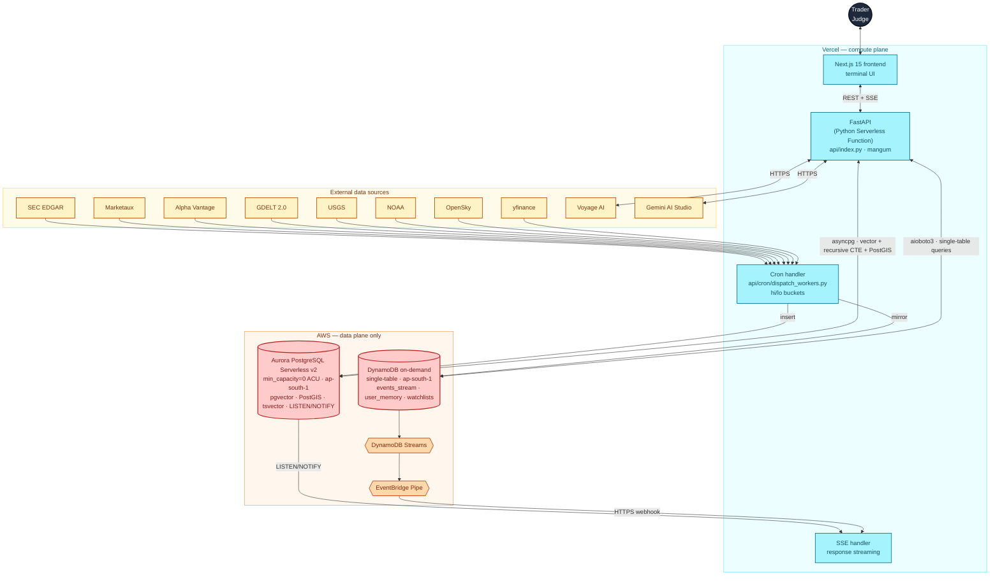

<div align="center">

# Cascade

### Watch the world cascade.

When a chip plant fires, a tanker stalls, or an 8-K drops, **Cascade** walks the supply chain three hops deep and ranks the **thirty downstream tickers about to move** — in seconds, not hours. Built end-to-end on **Vercel + AWS Databases** for the [H0: Hack the Zero Stack](https://h01.devpost.com/) hackathon.

[**Live terminal →**](https://cascade-app-pi.vercel.app) &nbsp;·&nbsp; [**Architecture →**](#architecture) &nbsp;·&nbsp; [**Demo video →**](#demo-video)

</div>

---

## The problem

A chip plant fire in Taiwan. An oil tanker stuck in the Red Sea. A surprise 8-K after the close. Within minutes hundreds of stocks reprice — but the link between *that headline* and the *30 companies it's about to hit* lives in an analyst's head, scattered across terminals, Discord servers, filings, and weather alerts. By the time a human stitches it together, the move is gone.

**Cascade is the missing connective tissue.** Live news, filings, social signals, and price ticks land in Aurora PostgreSQL; a `WITH RECURSIVE` CTE walks a 1,149-edge supplier / customer / peer graph three hops deep; Voyage `rerank-2.5` ranks the survivors; DynamoDB Streams mirrors the event firehose so every connected browser sees the cascade the moment it happens. For tickerless events — geopolitics, weather, regulatory rulings — Gemini infers the affected regions and sectors, range-validated against the Aurora company universe so hallucinated tickers never escape.

Two AWS databases. One agent. Every market shock visible the moment it happens.

---

## Two AWS databases, eight access patterns

The dual-database split is the architecture, not a demo flourish. Each pattern is matched to the database that does it best.

| Access pattern | Database | Why this DB |
|---|---|---|
| Vector recall over 1024-dim Voyage embeddings | **Aurora PostgreSQL** | `pgvector` HNSW — cosine in the same SQL the rest of the query already uses |
| Keyword recall (BM25-style) | **Aurora PostgreSQL** | `tsvector` + `GIN` — composes with the vector leg in one query via Reciprocal Rank Fusion |
| 3-hop supply-chain walk (1,149 directed edges) | **Aurora PostgreSQL** | `WITH RECURSIVE` CTE — typed joins, multiplicative path weight, single LIMIT |
| Geographic proximity (HQ within Nkm of a quake / hurricane) | **Aurora PostgreSQL** | `PostGIS` `ST_DWithin` over `geography(POINT, 4326)` + GIST index |
| In-database live push (one trigger, every browser) | **Aurora PostgreSQL** | `LISTEN/NOTIFY` — Vercel Function holds an `asyncpg` listener, streams via SSE |
| Single-digit-ms event mirror for live fanout | **DynamoDB on-demand** | `PK = EVENT#<source>` / `SK = <ingested_at>` — same shape, same partition |
| Per-device anonymous history (last 20 cascade views) | **DynamoDB on-demand** | `PK = USER#<device_id>` — sub-10ms reads, native TTL 30d, no GSI |
| Per-user watchlist | **DynamoDB on-demand** | `PK = WATCHLIST#<user_id>` — same table, one bill line |
| AWS-native live fanout to every Vercel instance | **DynamoDB Streams → EventBridge Pipe → HTTPS webhook** | Complements the Aurora `LISTEN/NOTIFY` channel — cold function joins live traffic without waiting on its own listener |

Aurora owns the analytical plane — vector + recursive walk + geography + FTS in *one query*. DynamoDB owns the real-time mirror — single-table, Streams, TTL, on-demand. Neither could do the other's job at hackathon cost.

---

## The recursive cascade walk

The H0 Technical Implementation centerpiece. The supply-chain walk is one Postgres CTE — see [db/schema.py](db/schema.py):

```sql
WITH RECURSIVE walk AS (
    SELECT
        r.from_ticker  AS root,
        r.from_ticker  AS path_from,
        r.to_ticker    AS ticker,
        r.type,
        r.weight       AS edge_weight,
        r.weight       AS cumulative_weight,
        1              AS hop
    FROM relationships r
    WHERE r.from_ticker = ANY($1::TEXT[])
      AND r.weight >= $3

    UNION ALL

    SELECT w.root, r.from_ticker, r.to_ticker, r.type, r.weight,
           w.cumulative_weight * r.weight,
           w.hop + 1
    FROM walk w
    JOIN relationships r ON r.from_ticker = w.ticker
    WHERE w.hop < $2
      AND r.weight >= $3
      AND r.to_ticker <> w.root
)
SELECT root, path_from, ticker, type, edge_weight, cumulative_weight, hop
FROM walk
ORDER BY hop ASC, cumulative_weight DESC
LIMIT 500;
```

Three parameters — root tickers, max hops, min edge weight. The cumulative weight (multiplicative across hops) is *just a column*, so the front-end's `cascade_score` ranking comes for free. It's native SQL that joins on the same `relationships` table the rest of the app already uses — no separate graph engine, no extra service.

---

## In-database push — one trigger, every browser

When a worker inserts an event, an `AFTER INSERT` trigger fires `pg_notify('events_new', NEW.id::text)`. The SSE Vercel Function holds an `asyncpg` connection open with `LISTEN events_new` and re-emits over the wire. No Redis, no queue, no Lambda — Postgres *is* the bus.

```sql
CREATE OR REPLACE FUNCTION notify_event_inserted() RETURNS TRIGGER AS $$
BEGIN
    PERFORM pg_notify('events_new', NEW.id::text);
    RETURN NEW;
END;
$$ LANGUAGE plpgsql;

CREATE TRIGGER trg_events_notify
AFTER INSERT ON events
FOR EACH ROW EXECUTE FUNCTION notify_event_inserted();
```

This is the *primary* live channel. The secondary channel — **DynamoDB Streams → EventBridge Pipe → HTTPS webhook → the same SSE** — fans the firehose out to every Vercel Function instance, so a cold function picks up live traffic without waiting for its own `LISTEN` to wake up. Either alone keeps the UI live; together they are redundancy plus a demonstrable dual-DB pitch.

---

## DynamoDB single-table — three entities, one bill

One table, three logical entities, distinguished by PK prefix. See [db/dynamo.py](db/dynamo.py).

| `PK`                | `SK`              | Entity                                       | TTL  | Streams |
|---------------------|-------------------|----------------------------------------------|------|---------|
| `EVENT#<source>`    | `<ingested_at>`   | Live event mirror, re-broadcast via Streams  | 14d  | ON      |
| `USER#<device_id>`  | `<viewed_at>`     | Anonymous cascade-view history (last 20)     | 30d  | —       |
| `WATCHLIST#<user>`  | `META`            | Per-user pinned tickers                      | —    | —       |

Why single-table:
- One resource bill, one connection, one IAM role to scope.
- All three entities are point-read / range-scan only — no joins, no GSI needed.
- TTL handles cleanup for events (14d) and history (30d) — no cron, no sweep job.
- Streams give us the AWS-native live fanout path for free.

---

## Why Million-scale works on this stack

| Layer | Idle cost | Scaling story |
|---|---|---|
| **Aurora PostgreSQL Serverless v2** | $0 (`min_capacity = 0 ACU` + 5-min auto-pause) | ACUs scale 0 → 16 on demand; HNSW + `WITH RECURSIVE` are single-digit-ms at seed size |
| **DynamoDB on-demand** | $0 (no provisioned capacity) | No capacity ceiling — billed per request, partition by `PK` |
| **Vercel** | $0 (Hobby) | Edge cache + global function regions; SSE backpressure is per-function |
| **Gemini** | $0 (AI Studio free tier) | Stateless HTTPS; geo-cascade results cached on the event row so the second click is instant |
| **Voyage AI** | $0 (free tier, 3 RPM) | Batched 64 per call; degrades gracefully to text-only when rate-limited |

A judge clicking around for ten minutes consumes ~200 ACU-seconds and a few hundred DynamoDB ops. The whole judging window costs us under $5. The architecture is identical from 1 user to 1M — only the Aurora ACU peak and DynamoDB partition count grow.

---

## Tickerless events via Gemini geo-cascade

When an event has no ticker — a geopolitical flare-up, a hurricane, a regulatory ruling — most terminals show nothing. Cascade asks Gemini in JSON-mode for a **structured impact hypothesis**: affected regions with geographic centroids (lat/lon, server-side range-validated to drop NaN / out-of-range hallucinations), sector exposure with confidence, transmission mechanism in one sentence, and a historical analog. Companies are validated against the Aurora company universe before anything hits the UI — hallucinated symbols never escape. Result is cached on the event row so the second click is instant. See [agent/geo_cascade.py](agent/geo_cascade.py).

---

## Agent Society — four reasoners in parallel

Beyond the cascade itself, four Gemini sub-agents — **Critic**, **Predictor**, **Memory**, **ELI5** — reason about each cascade in parallel. Each has a 15s timeout and a deterministic local fallback so the UI never blanks. **Memory** reads the user's last 20 cascade views from DynamoDB by `device_id` for grounded observations like *"you've opened TSM 4× this week, always during Taiwan events."* Per-field persistence into `cascades.society` (`jsonb`) means each agent streams in independently. See [agent/society.py](agent/society.py).

---

## Architecture



---

## Tech stack

**Frontend** — Next.js 15 App Router · TypeScript strict · Tailwind · react-globe.gl + three · Zustand · framer-motion · react-window virtual feed · SSE client.

**Backend (Vercel Python Serverless Functions)** — FastAPI wrapped with `mangum` ([api/index.py](api/index.py)) · `asyncpg` (Aurora PG) · `aioboto3` (DynamoDB) · `pgvector` Python bindings · Pydantic v2 · `sse-starlette` response streaming.

**Auth** — Vercel OIDC token (`x-vercel-oidc-token` header, per request) → STS `AssumeRoleWithWebIdentity` → temp creds for Aurora RDS IAM + DynamoDB. **No static AWS keys anywhere in code or env vars.** See [db/_aws_creds.py](db/_aws_creds.py).

**Ingestion** — One Vercel Cron Job dispatches eleven workers by bucket (`hi` every 5 min, `lo` hourly): SEC EDGAR 8-K · Marketaux · yfinance · Alpha Vantage · Reddit · RSS feeds · GDELT · USGS · NOAA · OpenSky · AISStream.

**AI** — Gemini `gemini-3-flash-preview` (AI Studio HTTPS, no GCP infra) for cascade synthesis, the agent society, and geo-cascade · Voyage AI `voyage-4` embeddings, `voyage-multimodal-3` images, `voyage-rerank-2.5` cross-encoder.

**Hosting** — Vercel Hobby ($0/mo) · Aurora Serverless v2 with `min_capacity = 0 ACU` ($0 idle) · DynamoDB on-demand (free tier covers hackathon volumes).

---

## Quick start (local dev)

Prereqs: Python 3.11+, Node 20+, an AWS account with Aurora PG + DynamoDB provisioned via [Vercel Marketplace AWS Databases](https://vercel.com/marketplace/aws-databases), a Voyage AI key, a Gemini key.

```bash
git clone https://github.com/rajkamal2819/cascade-app.git
cd cascade-app

# Backend
python3 -m venv .venv && source .venv/bin/activate
pip install -r requirements.txt
cp .env.example .env
# fill in POSTGRES_*, DYNAMODB_*, VOYAGE_API_KEY, GEMINI_API_KEY, CRON_SECRET, SEC_USER_AGENT

# Apply schema (pgvector + PostGIS + tsvector + HNSW + LISTEN/NOTIFY) + load seed
curl -X POST "http://localhost:8080/api/admin/bootstrap?key=$CRON_SECRET"
curl -X POST "http://localhost:8080/api/admin/seed?key=$CRON_SECRET"

# Ingest some events
python -m workers.sec_edgar --once
python -m workers.yfinance_ticks --once

# Run the API locally (mangum wraps the same app for Vercel in production)
uvicorn api.index:app --reload --port 8080

# In another shell — run the frontend
cd web && npm install && npm run dev
# → http://localhost:3000
```

---

## Repo layout

```
cascade-app/
├── web/                   Next.js terminal UI
│   ├── app/               landing + /terminal
│   └── components/        Globe, Feed, Cascade, GeoCascadePanel, AgentTrace, …
├── api/                   FastAPI + Vercel handlers
│   ├── index.py           Vercel Python entrypoint (mangum-wrapped FastAPI)
│   ├── feed.py            Aurora-backed events / stats / search / cascade / SSE / memory
│   ├── graph.py           companies + recursive-CTE walk + PostGIS proximity
│   ├── admin.py           schema bootstrap + seed + backfill (CRON_SECRET gated)
│   └── cron/              Vercel Cron Job dispatcher (hi / lo buckets)
├── agent/                 Gemini orchestration
│   ├── society.py         Critic + Predictor + Memory + ELI5
│   ├── geo_cascade.py     structured impact hypothesis + coord validation
│   └── cascade_reasoning.py  severity + risk factors synthesis
├── db/                    AWS data adapters
│   ├── aurora.py          asyncpg pool, RDS IAM auth via OIDC
│   ├── dynamo.py          aioboto3 single-table helpers
│   ├── _aws_creds.py      STS AssumeRoleWithWebIdentity via x-vercel-oidc-token
│   └── schema.py          DDL + recursive-CTE SQL
├── workers/               11 ingestion modules (poll_once / work)
├── embed/                 Voyage wrappers (text, multimodal, rerank, NER)
├── data/                  companies.json (102), relationships.json (1,149 edges)
├── vercel.json            Vercel config
└── requirements.txt       Vercel Python runtime deps
```

---

## Demo video

[](https://www.youtube.com/watch?v=ICiUKnO4LYQ)

▶ **[Watch the 3-minute demo on YouTube →](https://www.youtube.com/watch?v=ICiUKnO4LYQ)**

Walkthrough of the live terminal, the Aurora `WITH RECURSIVE` cascade walk, the `LISTEN/NOTIFY` live channel, the DynamoDB single-table mirror, and the Gemini geo-cascade for tickerless events.

---

## Built during the H0 submission period

Every commit in this repo is in-window evidence dated **May 27 – June 29, 2026**. The entire AWS + Vercel build is new work:

- Complete AWS data layer: [db/aurora.py](db/aurora.py), [db/dynamo.py](db/dynamo.py), [db/schema.py](db/schema.py).
- OIDC-based per-request AWS credential exchange ([db/_aws_creds.py](db/_aws_creds.py)) — no static keys, anywhere.
- Aurora schema: `pgvector(1024)` HNSW + PostGIS + `tsvector`/GIN + the `LISTEN/NOTIFY` trigger.
- DynamoDB single-table design (events / user_memory / watchlists) with TTL + Streams enabled.
- The `WITH RECURSIVE` supply-chain cascade-walk CTE.
- FastAPI deployed as Vercel Python Serverless Functions via `mangum` ([api/index.py](api/index.py)).
- Aurora-backed feed / stats / search / cascade / memory route layer ([api/feed.py](api/feed.py), [api/graph.py](api/graph.py), [api/admin.py](api/admin.py)).
- Vercel Cron Job dispatcher for 11 ingestion workers ([api/cron/dispatch_workers.py](api/cron/dispatch_workers.py)).
- Gemini agent society + geo-cascade reasoning ([agent/society.py](agent/society.py), [agent/geo_cascade.py](agent/geo_cascade.py)).
- Vercel Marketplace AWS Databases integration end-to-end.

The Next.js terminal UI (Globe, Feed, Cascade, GeoCascadePanel, AgentTrace) is our own design, built to talk to Aurora + DynamoDB over the live SSE channel.

---

## License

[Apache-2.0](LICENSE).

## Acknowledgements

Built with [Vercel](https://vercel.com/) + [v0](https://v0.dev/), [Amazon Aurora PostgreSQL](https://aws.amazon.com/rds/aurora/), [Amazon DynamoDB](https://aws.amazon.com/dynamodb/), [Google Gemini](https://ai.google.dev/), and [Voyage AI](https://www.voyageai.com/) embeddings + rerankers. For the [H0 hackathon](https://h01.devpost.com/) — `#H0Hackathon`.

---

<div align="center">

*Cascade — watch the world cascade. Every supply-chain shock, three hops deep, the moment it happens.*

</div>
