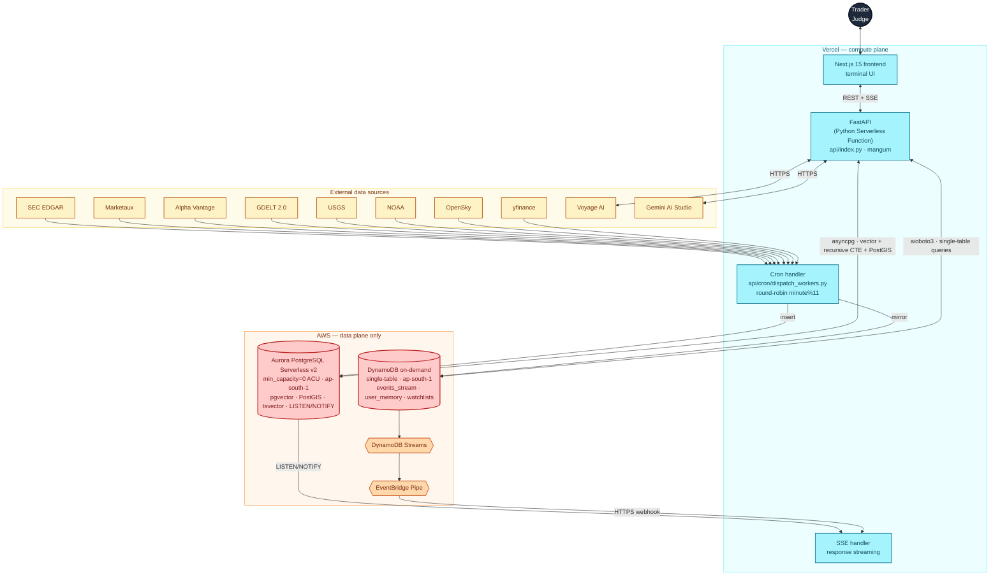

<div align="center">

# Cascade

### Real-time global market intelligence on the Zero Stack.

When a single headline moves markets, Cascade tells you *which 30 stocks move next* — in seconds, not hours. Built end-to-end on **Vercel + AWS Databases** for the [H0: Hack the Zero Stack](https://h01.devpost.com/) hackathon.

[**Live terminal →**](https://cascade-terminal.vercel.app) &nbsp;·&nbsp; [**Architecture →**](#architecture) &nbsp;·&nbsp; [**Demo video →**](#demo-video)

</div>

---

## The problem

A chip plant fire in Taiwan. An oil tanker stuck in the Red Sea. A Fed surprise. Within minutes, hundreds of stocks reprice. But the link between that headline and the *30 companies it's about to hit* lives in an analyst's head — scattered across Bloomberg terminals, Discord servers, SEC filings, and weather alerts. By the time a human stitches it together, the move is gone.

**Cascade is the missing connective tissue.** It ingests live news, filings, social signals, and price ticks into Aurora PostgreSQL; walks supply-chain graphs in real time with a `WITH RECURSIVE` CTE; reranks impacted companies with Voyage `rerank-2.5`; mirrors the live event firehose into DynamoDB so Streams can fan it out to every connected browser via SSE; and — for tickerless events like geopolitics, weather, and macro shocks — asks Gemini to infer the affected regions, sectors, and transmission mechanism, then plots structured coordinates onto a 3D globe.

Two AWS databases. One agent. Every market shock visible the moment it happens.

---

## What's distinctive

### 🧠 Aurora PostgreSQL as the analytical brain

One database holds events (with `pgvector` HNSW embeddings), cascades, companies (with `PostGIS` POINT geometry), and a 1149-edge supplier/customer/peer graph in `relationships`. Three Postgres features compose into one query:
- `pgvector` semantic recall (1024-dim cosine)
- `tsvector` + `GIN` keyword recall (RRF-fused with the vector leg in SQL)
- `WITH RECURSIVE` 3-hop graph walk over `relationships`, `weight >= 0.3` filter

Voyage `rerank-2.5` runs over the candidate set as a Python post-step. See [agent/tools.py → build_cascade](agent/tools.py).

### ⚡ DynamoDB as the real-time mirror

Every event insert lands twice: durable history in Aurora, hot record in **DynamoDB on-demand** (`ripple-dynamodb`, single-table design, `PK`/`SK` with entity-type prefixes). **DynamoDB Streams** → **EventBridge Pipe** → **HTTPS webhook** to a Vercel Function → SSE broadcast to every connected browser. No Lambda needed in the path.

User device history (`USER#<device_id>`) and watchlists (`WATCHLIST#<user_id>`) live in the same table — three logical entities, one table, one connection, single bill line. Rick Houlihan would approve.

### 🌐 Tickerless events via Gemini + structured-coordinate validation

When an event has no ticker — a geopolitical flare-up, a hurricane, a regulatory ruling — most terminals show nothing. Cascade asks Gemini 2.5 in JSON-mode to return a **structured impact hypothesis**: affected regions with geographic centroids (lat/lon, **server-side range-validated** to drop NaN / out-of-range hallucinations), sector exposure with confidence, transmission mechanism in one sentence, and a historical analog. Companies are validated against our Aurora-side ticker universe so hallucinated symbols never escape. See [agent/geo_cascade.py](agent/geo_cascade.py).

### 🔄 Two live channels into one SSE stream

The SSE Vercel Function (`api/sse.py`) subscribes to both:
1. **Aurora `LISTEN/NOTIFY`** — one trigger on `events` insert, asyncpg listener inside the function. Lowest latency, in-DB path.
2. **DynamoDB Streams → EventBridge Pipe → HTTPS webhook** — fans out to every Vercel Function instance. Pure-AWS path.

Both feed the same browser-facing SSE. Either alone is enough; together they're redundancy + a demo-able dual-DB pitch.

### 🧬 Agent Society (Critic, Predictor, Memory, ELI5)

Beyond synthesis, four Gemini sub-agents reason in parallel about each cascade. Each one degrades gracefully when Gemini times out — deterministic local fallback ensures the UI never blanks. Per-field persistence into Aurora `cascades.society jsonb` so the agents stream in independently. See [agent/society.py](agent/society.py).

---

## Architecture



---

## AWS Databases used

The two-database choice is deliberate — each owns the access pattern it's best at.

| # | Service | Where it lives | Why it owns this pattern |
|---|---|---|---|
| 1 | **Amazon Aurora PostgreSQL Serverless v2** | events · cascades · companies · relationships · prices | Three Postgres extensions compose in one query: `pgvector` for semantic recall, `tsvector` for keyword recall, `WITH RECURSIVE` for the 3-hop supply-chain walk. `PostGIS` for geo events. Auto-pause to 0 ACUs = $0 idle. |
| 2 | **Amazon DynamoDB** (on-demand) | events_stream · user_memory · watchlists (single table) | Sub-10ms reads at any scale. Streams provide the live-fanout backbone via EventBridge Pipe. TTL handles auto-cleanup. Single-table design with PK prefixes models three logical entities in one resource. |

---

## Tech stack

**Frontend** — Next.js 15 App Router · TypeScript strict · Tailwind · react-globe.gl + three · framer-motion · Zustand · react-window virtual feed · SSE client

**Backend** — Python 3.11 · FastAPI · `mangum` adapter to Vercel Python Serverless Functions · `asyncpg` (Aurora PG) · `aioboto3` (DynamoDB) · `pgvector` Python bindings · Pydantic v2 · sse-starlette response streaming

**Ingestion** — Vercel Cron Jobs invoke `api/cron/dispatch_workers.py` every minute, routing by `minute % 11` to the right worker module under `workers/`: SEC EDGAR 8-K · Marketaux · yfinance · Alpha Vantage · Reddit (gated) · RSS · GDELT · USGS · NOAA · OpenSky · AISStream

**AI** — Gemini (AI Studio key, `gemini-3-flash-preview`) for synthesis, geo-cascade, and the agent society — called as external HTTPS, no GCP infra · Voyage AI (`voyage-4` embeddings, `voyage-multimodal-3` images, `voyage-rerank-2.5` cross-encoder)

**Hosting** — Vercel (frontend + Python functions + cron, Hobby tier $0/mo) · Aurora Serverless v2 with auto-pause ($0 idle, ~$0.06/active-ACU-hour) · DynamoDB on-demand (free tier covers hackathon volumes)

---

## Quick start (local dev)

Prereqs: Python 3.11+, Node 20+, an AWS account with Aurora PG + DynamoDB provisioned via [v0 / Vercel Marketplace AWS Databases](https://vercel.com/marketplace/aws-databases), a Voyage AI key, a Gemini key.

```bash
git clone https://github.com/rajkamal2819/Cascade.git
cd Cascade

# Backend
python3 -m venv .venv && source .venv/bin/activate
pip install -r requirements.txt
cp .env.example .env  # fill in DATABASE_URL, DYNAMODB_TABLE, AWS_*, VOYAGE_API_KEY, GEMINI_API_KEY, SEC_USER_AGENT

# Provision Aurora schema (collections, pgvector + tsvector + PostGIS indexes, TTL partitioning, time-series partitions)
python -m scripts.setup_aurora
python -m scripts.seed_companies
python -m scripts.seed_relationships

# Ingest some events
python -m workers.sec_edgar --once
python -m workers.yfinance_ticks --once

# Run the API locally (still uses uvicorn for dev; mangum wraps it for Vercel)
uvicorn api.main:app --reload --port 8080

# In another shell — run the frontend
cd web && npm install && npm run dev
# → http://localhost:3000
```

---

## Repo layout

```
Cascade/
├── web/                Next.js terminal UI
│   ├── app/            landing + /terminal
│   └── components/     Globe, Feed, Cascade, GeoCascadePanel, AgentTrace, …
├── api/                FastAPI + Vercel handlers
│   ├── index.py        Vercel Python entrypoint (mangum-wrapped FastAPI app)
│   ├── main.py         FastAPI app + routes
│   ├── cron/           Vercel Cron Job handlers
│   └── ...             cascade · search · sse · multimodal · models · deps
├── agent/              Gemini orchestration
│   ├── tools.py        search_events, build_cascade, get_company, prices, stats
│   ├── geo_cascade.py  structured impact hypothesis + coord validation
│   ├── society.py      Critic + Predictor + Memory + ELI5
│   └── prompts.py
├── db/                 AWS data adapters (NEW for Cascade)
│   ├── aurora.py       asyncpg pool + pgvector + recursive CTE helpers
│   └── dynamo.py       aioboto3 + single-table helpers
├── workers/            11 ingestion modules (poll_once / work)
├── embed/              Voyage wrappers (text, multimodal, rerank, NER)
├── scripts/            setup_aurora, seed_*, backfill_embeddings, test_tools
├── data/               companies.json, relationships.json (1149 edges)
├── vercel.json         Python runtime + crons (single source of infra truth)
├── requirements.txt    Vercel Python runtime deps
└── pyproject.toml      local dev tools
```

---

## Demo video

📺 Coming soon — walkthrough of the live terminal, Aurora recursive-CTE cascade walk, DynamoDB Streams driving SSE, and the Gemini geo-cascade for tickerless events.

---

## Status

| Phase | Title | State |
|---|---|---|
| 1 | AWS account + DBs provisioned via Vercel Marketplace | ✅ |
| 2 | Repo bootstrap + first Vercel deploy | ✅ |
| 3 | Aurora schema (pgvector + PostGIS + recursive CTE) | ✅ |
| 4 | Data adapter layer (db/aurora.py + db/dynamo.py) | ✅ |
| 5 | FastAPI → Vercel Functions + Cron Jobs | ✅ |
| 6 | Gemini society + narrative + geo-cascade | ✅ |
| 7 | Voyage embeddings + hybrid search + rerank-2.5 | ✅ |
| 8 | Aurora LISTEN/NOTIFY live SSE channel | ✅ |
| 9 | DynamoDB Streams → EventBridge Pipe → SSE webhook | ⏳ AWS Console wiring |
| 10 | Submission polish (video + bonus content + screenshots) | ⏳ |

---

## Significant updates during the H0 submission period (per Devpost rules)

> Cascade is built on a prior MongoDB/GCP iteration. **All AWS Databases and Vercel integration work was done between May 27 and June 29, 2026** — every commit in this repo is in-window evidence. Specifically: the Aurora PostgreSQL schema (`pgvector` HNSW + PostGIS + `WITH RECURSIVE` cascade walk + `LISTEN/NOTIFY` trigger), the DynamoDB single-table design with PK/SK prefixes for events_stream / user_memory / watchlists, the OIDC-based per-request AWS credential exchange (`db/_aws_creds.py`), the migration of the FastAPI app to Vercel Python Serverless Functions via `mangum` (`api/index.py`), the dual-database SSE pipeline (Aurora LISTEN/NOTIFY + DynamoDB Streams → EventBridge), the Gemini geo-cascade for tickerless events validated against the Aurora company universe, the Voyage hybrid search (pgvector cosine + tsvector + Reciprocal Rank Fusion + rerank-2.5), and the v0/Vercel Marketplace AWS Databases integration are all new work. The Next.js frontend shell was carried over; the entire backend, the AWS data layer, and the Vercel-native deployment surface were built during the H0 submission window.

---

## License

[Apache-2.0](LICENSE).

---

## Acknowledgements

Built with [Vercel](https://vercel.com/) + [v0](https://v0.dev/), [Amazon Aurora PostgreSQL](https://aws.amazon.com/rds/aurora/), [Amazon DynamoDB](https://aws.amazon.com/dynamodb/), [Google Gemini](https://ai.google.dev/), and [Voyage AI](https://www.voyageai.com/) embeddings + rerankers. For the [H0 hackathon](https://h01.devpost.com/) — `#H0Hackathon`.

---

<div align="center">

*Cascade — two AWS databases, one agent, every market shock visible the moment it happens.*

</div>
